# Real-Time Flight Monitoring & Analytics System

Aviation data is highly fragmented across multiple independent sources. Real-time telemetry, flight schedules, airport details, and weather data are all published separately, and no single API provides a unified or complete view of global aviation activity. This creates gaps in
operational monitoring, delay analysis, and situational awareness. To understand real-time flight patterns and identify performance trends, an integrated system is required to collect, combine, and analyze data from multiple providers.

I have built a live dashboard containing global flight activity, operational metrics, delay analysis, and weather correlations, with the data collected from four external API's, using Python-based Kafka producers and consumers. 

### System Architecture

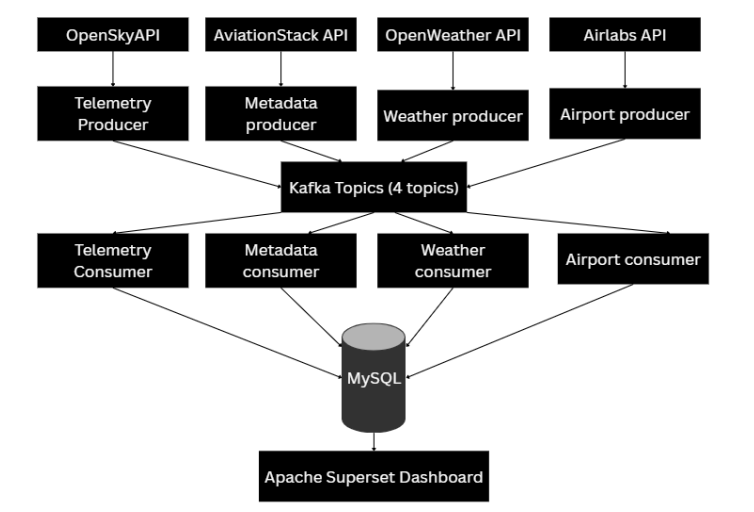

### Data provided by each API

OpenSky – live flight telemetry  
AviationStack – flight schedules, statuses, and delays  
OpenWeather – airport-specific weather conditions  
AirLabs – global airport database with coordinates  

---
# Real Time Global Flights Dashboard

This section provides a high-level view of global air traffic using real-time telemetry and route metadata.

##SECTION 1 - GLOBAL OVERVIEW

### *Arc Map — Global Flight Routes*
Displays live flight routes across the world using aircraft positions from telemetry_events.Shows large-scale movement patterns and active corridors.

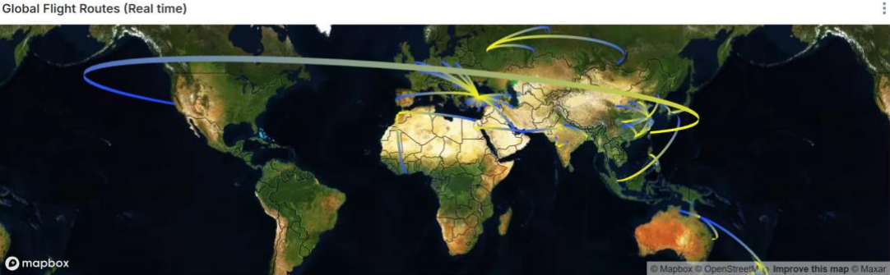

### *Global Air Traffic Intensity Heatmap*
Aggregates flight positions into a density heatmap, highlighting busy regions and hubs.

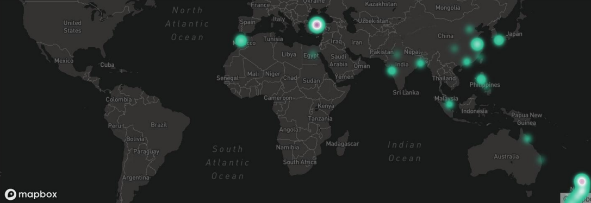

### *Top Origin and Destination Airports*
Ranks airports by number of departures and arrivals, based on flight_metadata, to identify the major hubs.

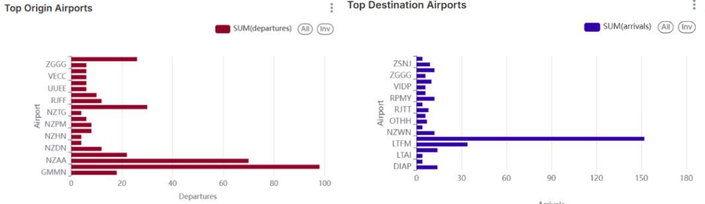

### *Global Routes Reference Table*
Lists structured routes with airport coordinates and flight metadata, providing a searchable lookup.

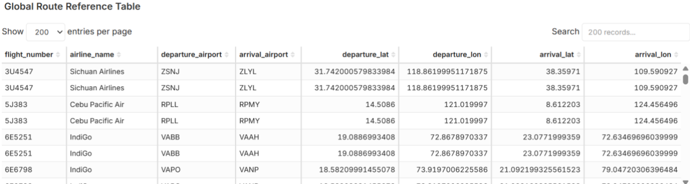

---

##SECTION 2 - LIVE OPERATIONAL METRICS

This section analyzes active flights in real time using telemetry data.

### *Flight Speed Distribution*

Histogram showing the distribution of aircraft velocities captured in the latest telemetry window.

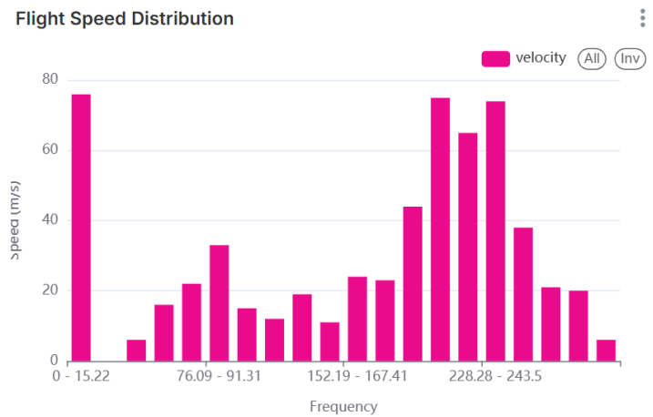

### *Flight State Distribution (Climb / Level / Descend)*
Classification of flights using vertical rate from telemetry_events, indicating their operational phase.

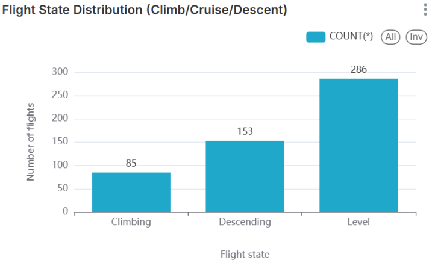

### *Altitude vs Velocity Scatterplot*
Correlates altitude with speed to highlight climb profiles and performance patterns.

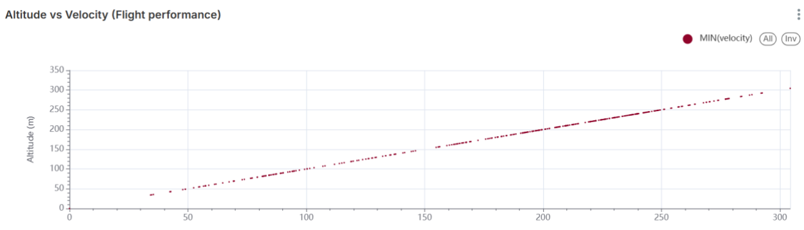

### *Heading Distribution*
Shows the directional flow of global traffic using aircraft heading values.

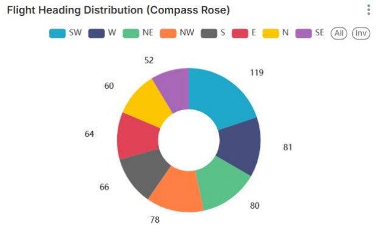

---

##SECTION 3 - FLIGHT PERFORMANCE AND DELAYS

This section uses structured metadata to analyze delay patterns and operational punctuality.

### *Average Delay per Airline*

Computes mean delay values per airline, offering comparative punctuality insights.

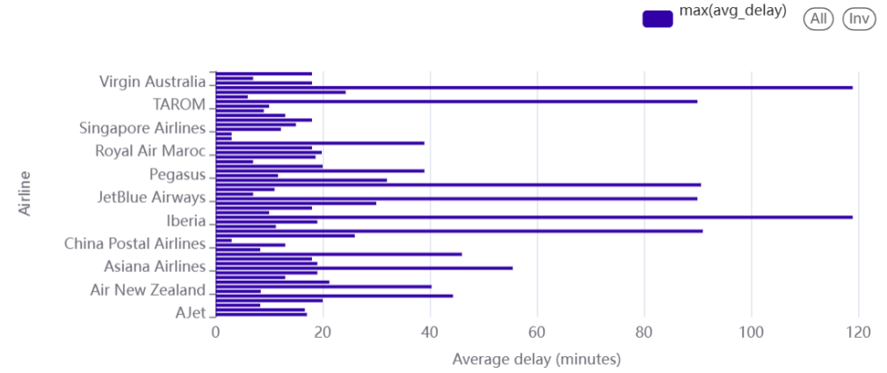

### *Delay Distribution*

Histogram showing how delays spread across all tracked flights.

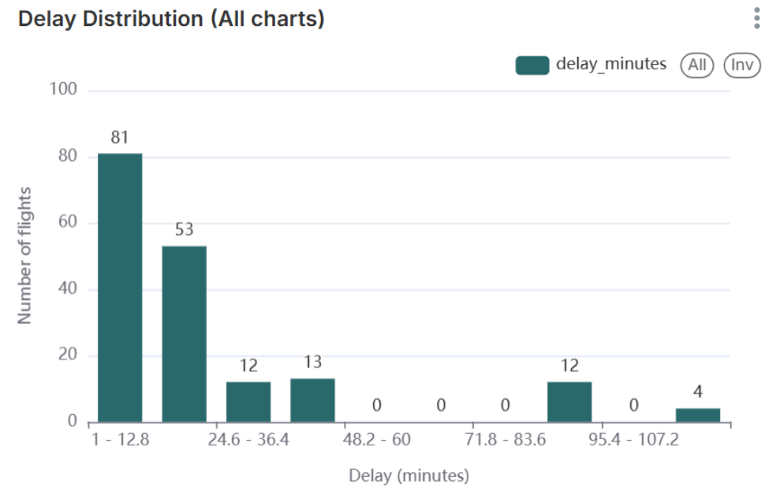

### *Flight Status Breakdown*

Pie chart dividing flights into scheduled, active, and landed categories.

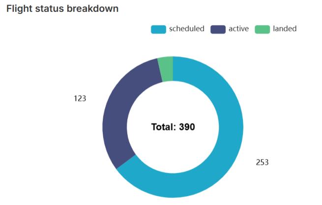

### *Top Delayed Routes*

Lists the routes sorted by highest average delay.

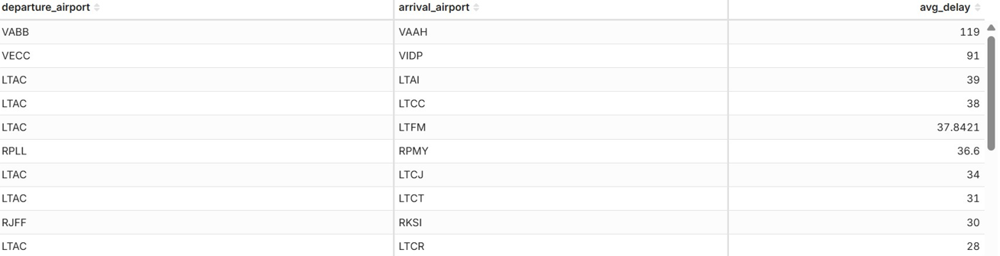

### *On-Time Performance Score*

Percentage of flights with delay under 15 minutes, following industry standards.

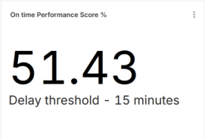

---

##SECTION 4 - WEATHER FLIGHT CORRELATION

This section analyzes how weather conditions influence flight delays.

### *Temperature vs Time (Per Airport)*

Line chart showing temperature changes for active airports over time.

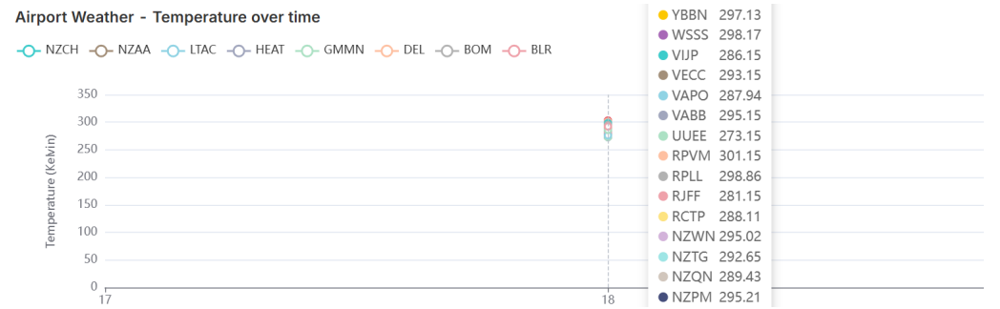

### *Delay vs Temperature Scatterplot*

Displays correlation between temperature and flight delays for airport departures.

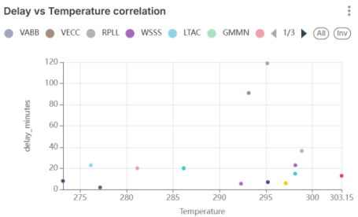

### *Delay vs Wind Speed Scatterplot*

Explores how wind speed relates to delay patterns

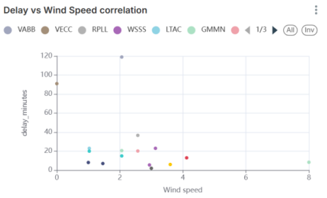

### *Weather Reference Table*

Raw weather measurements used across all correlation charts.

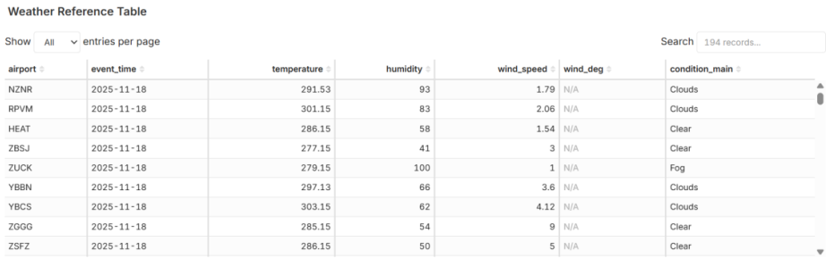

---

##SECTION 5 - GEO VISUALS

These visualizations provide spatial context using maps and 3D geospatial layers.

### *Airport Locations Map*

Shows global airport coordinates from airport_data.

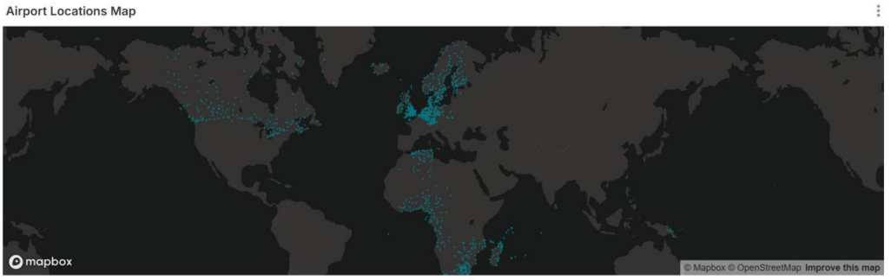

### *Airline-Specific Arc Map*

Highlights the route network for a selected airline.

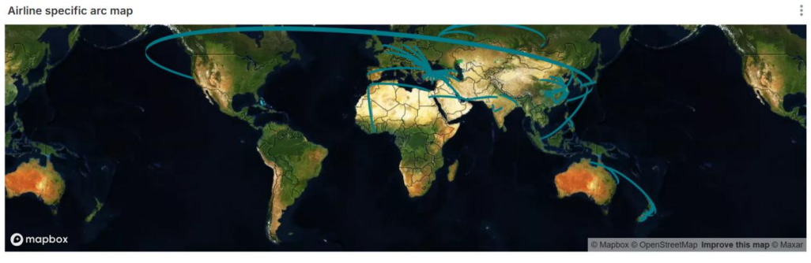

### *India Route Intensity Heatmap*

Regional heatmap focused on Indian airspace activity

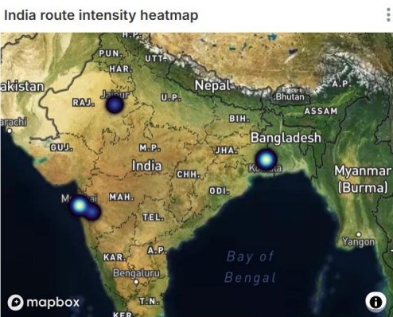

